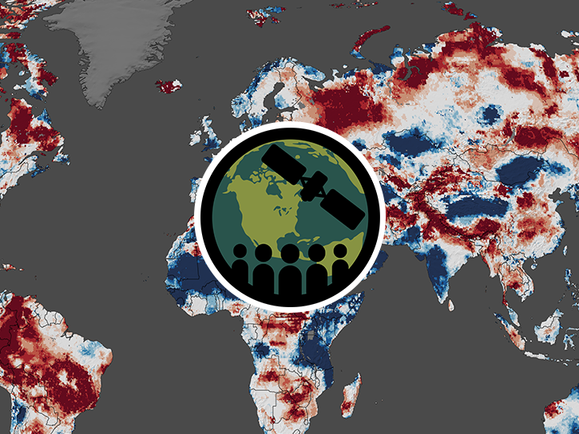

# Monitoring Groundwater Changes for Water Resources Management

## [Training Page](https://www.earthdata.nasa.gov/learn/trainings/monitoring-groundwater-changes-water-resources-management)

### All [Python Notebooks](/data/) and [Data](/data/) for Exercises & Homework can be found in the [Data](/data/) directory.

Groundwater is a vital resource, especially in arid regions where surface water is limited. The U.S. Geological Survey (USGS) reports approximately 82 billion gallons of groundwater are withdrawn daily in the U.S. for domestic, irrigation, industrial, mining, thermoelectric, livestock, and aquaculture uses. 

The Gravity Recovery and Climate Experiment (GRACE, 2002–2017) and GRACE Follow-On (GRACE-FO, 2018–present) satellite missions — supported by NASA and the German Research Centre for Geosciences (GFZ) — provide monthly estimates of changes in terrestrial water storage (the sum of groundwater, soil moisture, surface waters, snow, and ice) at spatial resolutions no better than about 150,000 km² at mid-latitudes. While useful for detection of large-scale changes, the coarse resolution limits regional-scale groundwater assessments. 

There are, however, groundwater products with higher spatial resolutions that can be useful for finer scale monitoring. A new product from Observational Products for End-Users from Remote Sensing Analysis (OPERA) provides surface displacement products (DISP) for North America that use Synthetic Aperture Radar (SAR) from Sentinel-1 at 30 m2 (and from NISAR next year) to indicate subsidence due to groundwater withdrawal. In addition, NASA's Global Land Data Assimilation System (GLDAS) assimilates GRACE/GRACE-FO data into a land surface model along with other higher resolution inputs, producing daily outputs on a 0.25° (~25 km) grid. 

This three-part training focuses on an overview of GRACE/GRACE-FO data, OPERA-DISP data, and GLDAS groundwater data for assessing seasonal to interannual groundwater changes at various spatial scales. The training provides hands-on experience in accessing and analyzing these products for applications.

